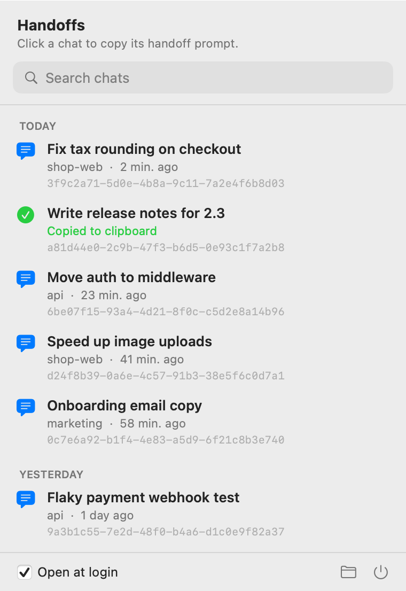
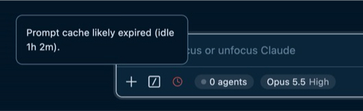

<a href="https://proxylang.dev/?utm_source=handoffbar&utm_medium=github&utm_campaign=getstarted15"></a>

<p align="center"></p>

<h1 align="center">HandoffBar</h1>

<p align="center">Pick up any <a href="https://claude.com/claude-code">Claude Code</a> chat where you left off (without wasting tokens).<br>
캐시가 만료돼도, Claude Code 대화를 토큰 낭비 없이 하던 그대로 이어가세요.<br>
<a href="https://github.com/Proxylang/handoff-bar/releases/latest/download/HandoffBar.dmg"><b>Download for Mac · Mac용 다운로드</b></a> · <a href="https://handoffbar.proxylang.dev">Website · 웹사이트</a></p>

<p align="center"><picture>
<source media="(prefers-color-scheme: dark)" srcset="site/panel-dark.png">

</picture></p>

## What it does · 하는 일

Claude Code caches each chat so replies stay fast and cheap. Leave a chat alone too long and the cache expires. The next message then re-reads the whole chat at full price.

You can see when this happens. Claude Code shows a red clock in the message box, and hovering it says the cache expired:

<p align="center"></p>

HandoffBar saves you before that point. A few minutes before a chat's cache expires, it saves a **handoff**: a short Markdown summary of that chat. Click the hand in your menu bar, click the chat, and paste the handoff into a new Claude Code chat. You keep going in the new chat instead of paying to reload the old one.

It works with Claude Code in the terminal, the VS Code extension, and the Code tab of the Claude desktop app. All three save chats to the same place.

**한국어**

Claude Code는 대화마다 캐시를 만들어 두기 때문에 답변이 빠르고 비용도 적게 들어요. 그런데 대화를 한동안 그대로 두면 캐시가 만료되고, 그다음 메시지부터는 대화 전체를 정가로 다시 읽게 돼요.

캐시가 만료되면 Claude Code 입력창에 빨간 시계 아이콘이 떠요. 마우스를 올려 보면 위 그림처럼 "Prompt cache likely expired (idle 1h 2m)"라는 안내가 나와요.

HandoffBar는 그 전에 미리 준비해 둬요. 캐시가 만료되기 몇 분 전에 그 대화의 **핸드오프**를 저장하는데, 핸드오프는 대화 내용을 짧게 정리한 Markdown 요약이에요. 메뉴 막대의 손 아이콘을 누르고 대화를 고른 뒤, 새 Claude Code 대화에 붙여 넣기만 하면 돼요. 이전 대화를 비싸게 다시 불러올 필요 없이 새 대화에서 바로 이어서 작업할 수 있어요.

터미널용 Claude Code, VS Code 확장 프로그램, Claude 데스크톱 앱의 Code 탭 어디서든 쓸 수 있어요. 셋 다 같은 위치에 대화를 저장하거든요.

## Features · 기능

- **Saves handoffs on time.** Each chat's handoff is written a few minutes before its cache expires. HandoffBar works out per chat whether the cache lasts 5 minutes or 1 hour.
- **One click to copy.** Click a chat and its handoff prompt is on your clipboard, ready to paste.
- **Search.** Type to filter by chat title, project, or chat id. Search covers every saved handoff.
- **Your tab names.** Chats show the name you gave the tab, even if you rename it after the handoff was saved.
- **Easy to scan.** Chats are grouped by day, with the project and how long ago. Hover a chat to see your last request.
- **Open at login.** One checkbox keeps it running after a restart.
- **Light and dark mode.** Follows your Mac's setting.
- **Terminal, VS Code, desktop.** Works with Claude Code in the terminal, the VS Code extension, and the Claude desktop app's Code tab.
- **Update notice.** When a new version is out, the panel shows a Download button.
- **Local only.** Your chats never leave your Mac. No account, no analytics, no AI.

**한국어**

- **알아서 제때 저장.** 캐시가 만료되기 몇 분 전에 대화별로 핸드오프를 저장해요. 캐시가 5분짜리인지 1시간짜리인지도 대화마다 알아서 확인해요.
- **클릭 한 번으로 복사.** 대화를 누르면 핸드오프 프롬프트가 바로 클립보드에 복사돼요.
- **검색.** 대화 제목, 프로젝트, 대화 ID로 찾을 수 있어요. 저장된 핸드오프 전체에서 검색해요.
- **내가 정한 탭 이름 그대로.** 핸드오프가 저장된 뒤에 탭 이름을 바꿔도 바뀐 이름으로 보여요.
- **한눈에 정리.** 날짜별로 묶어서 프로젝트 이름, 지난 시간과 함께 보여 줘요. 마우스를 올리면 마지막 요청도 확인할 수 있어요.
- **로그인 시 자동 실행.** 체크박스 하나만 켜 두면 Mac을 다시 켜도 계속 실행돼요.
- **라이트·다크 모드.** Mac 화면 설정을 그대로 따라가요.
- **터미널, VS Code, 데스크톱 앱 지원.** 터미널용 Claude Code, VS Code 확장 프로그램, Claude 데스크톱 앱의 Code 탭에서 모두 쓸 수 있어요.
- **업데이트 알림.** 새 버전이 나오면 패널에 다운로드 버튼이 떠요.
- **내 Mac에서만 동작.** 대화 내용은 내 Mac 밖으로 절대 나가지 않아요. 계정도, 분석 도구도, AI도 없어요.

## What a handoff contains · 핸드오프에 담기는 내용

- The chat's title (the name you gave the tab, or the title Claude Code generated)
- The working folder, git branch, and path to the old chat file
- Your first request and your last 10 requests
- Choices you made when Claude asked you to pick (the question, its options, and your answer)
- The next steps Claude listed at the end of the chat
- Commands Claude started in the background, such as dev servers
- The last error, if it happened in the final few steps
- Claude's own summary of the chat, if the chat got long enough for Claude Code to summarize it
- The files the chat edited
- Claude's last reply

Handoffs are saved in `~/.claude/handoffs/`, one file per chat, named by chat id. HandoffBar builds them by reading the chat file. It does not use AI and does not run any commands on your Mac.

**한국어**

- 대화 제목 (탭에 직접 붙인 이름 또는 Claude Code가 자동으로 만든 제목)
- 작업 폴더, git 브랜치, 이전 대화 파일 경로
- 첫 요청과 최근 요청 10개
- Claude가 선택을 물었을 때 내가 고른 답 (질문, 선택지, 내 답변)
- 대화 끝에 Claude가 정리한 다음 할 일
- Claude가 백그라운드로 실행한 명령 (개발 서버 등)
- 마지막 몇 단계에서 난 오류
- 대화가 길어져 Claude Code가 요약을 만들었다면, 그 요약
- 그 대화에서 수정한 파일 목록
- Claude의 마지막 답변

핸드오프는 `~/.claude/handoffs/` 폴더에 대화마다 하나씩, 대화 ID를 파일 이름으로 저장돼요. HandoffBar는 대화 파일을 읽어서 핸드오프를 만들어요. AI를 쓰지 않고, 내 Mac에서 어떤 명령도 실행하지 않아요.

## When handoffs are written · 핸드오프 저장 시점

Each Claude Code chat gets a cache that lasts either 5 minutes or 1 hour. HandoffBar checks your chat files in `~/.claude/projects/` once a minute and reads which cache each chat got from the usage data Claude Code saves. Then it writes the handoff:

- 3 minutes after the last reply, for every chat. That is 2 minutes before a 5-minute cache expires.
- Again 5 minutes before a 1-hour cache expires. The chat moves back to the top of the list.

A chat's cache can switch between 5 minutes and 1 hour, for example after you sign in to a different account. The 3-minute save means a handoff is ready either way.

A new reply in that chat resets the timer. Chats started in a temp folder (usually scripts running Claude Code) are skipped.

**한국어**

Claude Code 대화의 캐시는 5분 또는 1시간 동안 유지돼요. HandoffBar는 1분마다 `~/.claude/projects/` 폴더의 대화 파일을 살펴보고, Claude Code가 기록해 둔 사용량 데이터로 대화별 캐시 길이를 확인해요. 그리고 아래 시점에 핸드오프를 저장해요.

- 모든 대화: 마지막 답변 3분 후. 5분 캐시라면 만료 2분 전이에요.
- 1시간 캐시: 만료 5분 전에 한 번 더 저장해요. 그 대화가 목록 맨 위로 다시 올라와요.

다른 계정으로 로그인하면 대화 캐시가 5분과 1시간 사이에서 바뀔 수 있어요. 3분 저장 덕분에 어느 쪽이든 핸드오프가 준비돼 있어요.

그 대화에 새 답변이 오면 타이머는 처음부터 다시 시작돼요. 임시 폴더에서 시작된 대화(대개 스크립트가 Claude Code를 실행한 경우)는 건너뛰어요.

## Security · 보안

Your chats stay on your Mac. HandoffBar never sends your chats, handoffs, or anything about you anywhere: no account, no analytics, no AI model. Nothing is processed or shared outside your machine.

The app makes one network request: once a day it asks GitHub for the latest HandoffBar version number, so it can tell you when an update is out. That request carries no data from your Mac.

How it works:

- **Reads** only the chat files Claude Code already saves in `~/.claude/projects` (one JSON line per message). It reads the cache usage numbers in them to know when a cache will expire.
- **Writes** only one Markdown file per chat in `~/.claude/handoffs`.
- **Copies** to your clipboard only when you click a chat.
- **Built** as a native Swift app (SwiftUI and AppKit), about 780 lines, with no third-party code. The only network code is the version check in [Updater.swift](Sources/Updater.swift).
- **Signed** with a Developer ID, built with Apple's hardened runtime, and notarized by Apple. It is not sandboxed, because it needs to read `~/.claude`.

The source is short enough to read in one sitting: [Sources/](Sources/).

**한국어**

대화 내용은 내 Mac 안에만 있어요. HandoffBar는 대화, 핸드오프, 사용자 정보를 어디에도 보내지 않아요. 계정, 분석 도구, AI 모델 모두 쓰지 않고, 외부에서 처리하거나 공유하는 데이터도 전혀 없어요.

네트워크 요청은 딱 하나예요. 하루에 한 번 GitHub에 최신 HandoffBar 버전 번호를 물어봐서, 업데이트가 나오면 알려 드려요. 이 요청에는 내 Mac의 데이터가 전혀 담기지 않아요.

작동 방식:

- **읽기:** Claude Code가 `~/.claude/projects`에 저장해 둔 대화 파일만 읽어요(메시지 하나당 JSON 한 줄). 여기에 담긴 캐시 사용량 정보로 캐시가 언제 만료될지 계산해요.
- **쓰기:** `~/.claude/handoffs`에 대화마다 Markdown 파일 하나만 만들어요.
- **복사:** 대화를 클릭할 때만 클립보드를 사용해요.
- **구성:** Swift로 만든 네이티브 앱(SwiftUI, AppKit)이에요. 코드는 약 780줄이고 외부 라이브러리는 하나도 쓰지 않아요. 네트워크 코드는 [Updater.swift](Sources/Updater.swift)의 버전 확인 하나뿐이에요.
- **서명:** Developer ID로 서명하고 Apple의 hardened runtime을 적용해 빌드했으며, Apple 공증도 받았어요. `~/.claude` 폴더를 읽어야 해서 샌드박스는 적용하지 않았어요.

소스 코드는 금방 다 읽을 수 있을 만큼 짧아요: [Sources/](Sources/).

## Install · 설치

1. Download [HandoffBar.dmg](https://github.com/Proxylang/handoff-bar/releases/latest/download/HandoffBar.dmg).
2. Open it and drag HandoffBar into Applications.
3. Open HandoffBar, click the hand in your menu bar, and tick **Open at login**.

Needs macOS 13 or later. Works on Apple Silicon and Intel. The app is signed and notarized by Apple.

If you use a menu bar manager such as Ice or Bartender, it may hide the new icon. Drag it into the visible part of the menu bar.

**Windows:** a Windows version is on its way to the Microsoft Store. Its source is in [windows/](windows/).

**한국어**

1. [HandoffBar.dmg](https://github.com/Proxylang/handoff-bar/releases/latest/download/HandoffBar.dmg)를 내려받아요.
2. 파일을 열고 HandoffBar를 응용 프로그램 폴더로 끌어다 놓아요.
3. HandoffBar를 실행한 뒤 메뉴 막대의 손 아이콘을 누르고 **Open at login**에 체크해요.

macOS 13 이상에서 동작하고, Apple Silicon과 Intel Mac을 모두 지원해요. Apple의 서명과 공증을 받은 앱이라 경고 없이 바로 열려요.

Ice나 Bartender 같은 메뉴 막대 정리 앱을 쓰고 있다면 새 아이콘이 숨겨질 수 있어요. 그럴 땐 아이콘을 메뉴 막대의 보이는 영역으로 끌어다 놓으세요.

**Windows:** Windows 버전은 곧 Microsoft Store에 올라와요. 소스 코드는 [windows/](windows/) 폴더에 있어요.

## Build from source · 소스에서 빌드

```
./build.sh
```

This builds the app, signs it, copies it to `~/Applications`, and starts it. It needs Apple's command line tools (`xcode-select --install`). Without a Developer ID certificate the app is signed for your Mac only.

To make a notarized download, store a notarytool keychain profile first, then run:

```
./build.sh release <profile name>
```

The installer lands in `dist/HandoffBar.dmg`, with a zip of the app next to it.

To redraw the app icon:

```
swift tools/make-icon.swift
iconutil -c icns AppIcon.iconset -o AppIcon.icns
```

The website is the static `site/` folder.

**한국어**

`./build.sh`를 실행하면 앱을 빌드하고 서명한 다음, `~/Applications`에 복사해서 실행해요. Apple 명령줄 도구가 필요해요(`xcode-select --install`). Developer ID 인증서가 없으면 빌드한 Mac에서만 실행되도록 서명돼요.

공증된 설치 파일을 만들려면 먼저 notarytool 키체인 프로필을 저장한 다음 `./build.sh release <프로필 이름>`을 실행하세요. 설치 파일은 `dist/HandoffBar.dmg`에, 앱 zip 파일은 그 옆에 만들어져요.

앱 아이콘은 위의 두 명령으로 다시 만들 수 있어요. 웹사이트는 `site/` 폴더에 있는 정적 파일이에요.

## Made by Proxylang · 만든 곳

HandoffBar is made by [Proxylang](https://proxylang.dev). Proxylang translates websites into 77+ languages. Add one line of code and your site is live in other languages in about a minute, with per-language SEO built in.

HandoffBar is not affiliated with Anthropic. MIT licensed. [Privacy policy](https://handoffbar.proxylang.dev/privacy.html).

**한국어**

HandoffBar는 [Proxylang](https://proxylang.dev)이 만들었어요. Proxylang은 웹사이트를 77개 이상의 언어로 번역해 주는 서비스예요. 코드 한 줄만 추가하면 1분 정도 만에 사이트가 여러 언어로 열리고, 언어별 SEO도 기본으로 지원해요.

HandoffBar는 Anthropic과 관련이 없어요. MIT 라이선스로 배포해요. [개인정보 처리방침](https://handoffbar.proxylang.dev/privacy.html).
